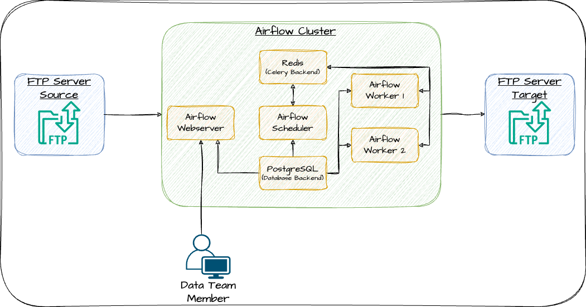

<a name="readme-top"></a>
<!-- PROJECT TITLE -->
<div align="center">
<h1 align="center">SFTP TRANSFER WITH AIRFLOW</h1>
</div>

<!-- TABLE OF CONTENTS -->
<details>
  <summary>Table of Contents</summary>
  <ol>
    <li>
      <a href="#description-of-the-problem">Description of the problem</a>
      <ul>
        <li><a href="#examples">Examples</a></li>
      </ul>
    </li>
    <li>
        <a href="#the-architecture">The architecture</a>
    </li>
    <li>
        <a href="#project-structure">Project Structure</a>
    </li>
    <li>
        <a href="#getting-started">Getting Started</a>
        <ul>
        <li><a href="#prerequisites">Prerequisites</a></li>
        <li><a href="#start-project">Start project</a></li>
        <li><a href="#description-services">Description services</a></li>
        <li><a href="#guide-to-the-project">Guide to the project</a></li>
        <li><a href="#stop-project">Stop project</a></li>
      </ul>
    </li>
  </ol>
</details>

<!-- Description of the problem -->
## Description of the problem  
Develop an Apache Airflow DAG that facilitates the transfer of files from the SFTP server at `<source>` to the SFTP server at `<target>`
and ensures the preservation of the original directory structure.  
The synchronization process should be unidirectional; hence, any modification made on `<target>` must not impact the `<source>`.  
Deleted files on SFTP server at <source> must remain intact on <target> server.  

### Examples:  
* On March 1st, 2024, when a file named sftp://<source>/a/b/c/file_1.txt is detected on the source server, it should be replicated to sftp://<target>/a/b/c/file_1.txt on the destination server.  
* On March 2nd, 2024, a file named sftp://<source>/a/b/c/file_2.txt appears on the source server and subsequently should be transferred to sftp://<target>/a/b/c/file_2.txt on the destination server.  
* On March 3rd, 2024, a file named sftp://<source>/a/b/c/file_3.txt appears on the source server and should then be transferred to sftp://<target>/a/b/c/file_3.txt on the destination server.  

<p align="right">(<a href="#readme-top">back to top</a>)</p>

<!-- The architecture -->
## The architecture  
  
Details of setting up project services can be found in the [docker-compose.yml](docker-compose.yml)

<p align="right">(<a href="#readme-top">back to top</a>)</p>

<!-- Project structure --> 
## Project structure  
```
|- dags/
|   |- configs/                     # configs for dags
|   |- libs/                        # functions for processing
|   |- sftp_file_transfer_dag.py    # sftp file transfer dag
|- images/
|- .gitignore
|- docker-compose.yml               # all services of project
|- README.md
|- requirements.txt                 # libs need install for project
|- ftp_source                       # storage of ftp source server
|- ftp_target                       # storage of ftp target server
|- history.log                      # store information about the files that have been transferred
```

<p align="right">(<a href="#readme-top">back to top</a>)</p>

<!-- Getting Started -->  
## Getting Started  

### Prerequisites  
To run the project, you need to have **Docker** and **Docker Compose** installed.  

### Start project  
To start project: ```docker-compose up -d```  

### Description services  
- **ftp-server**: service for ftp source and ftp target  
- **redis**: service for celery backend of airflow cluster  
- **postgres**: backend database for airflow cluster  
- **airflow-webserver**: Airflow webserver  
- **airflow-scheduler**: Airflow scheduler  
- **airflow-worker1**: Airflow worker  
- **airflow-worker2**: Airflow worker  

### Guide to the project  
#### 1. Open Airflow Website Interface
- Visit [localhost:8080](http://localhost:8080) to open airflow web interface. Use the username and password admin | admin respectively to log in  
- On the main web screen, you will see one DAG named: **sftp_transfer_dag**  
#### 2. Test dag  
2.1 In the project directory, you will find two folders named: **ftp_source** and **ftp_target**  
- **ftp_source**: the folder that stores files similar to the ftp source  
- **ftp_target**: the folder that stores files similar to the ftp target (file transfer from ftp source)  

2.2 Add files(can with folder structure) to ftp_source folder  
2.3 On Airflow website, trigger dag then checking result in folder ftp_target  

### Stop project  
To stop project: ```docker-compose down```

<p align="right">(<a href="#readme-top">back to top</a>)</p>

<!-- Explain solution -->  
## Explain solution  
1. Read file from ftp source  
2. Check if the file has been transferred previously    
- If the file has been transferred in the past, it will be skipped  
- If the file has not been transferred in the past, it will be transferred and note log to history.log file  

<p align="right">(<a href="#readme-top">back to top</a>)</p>